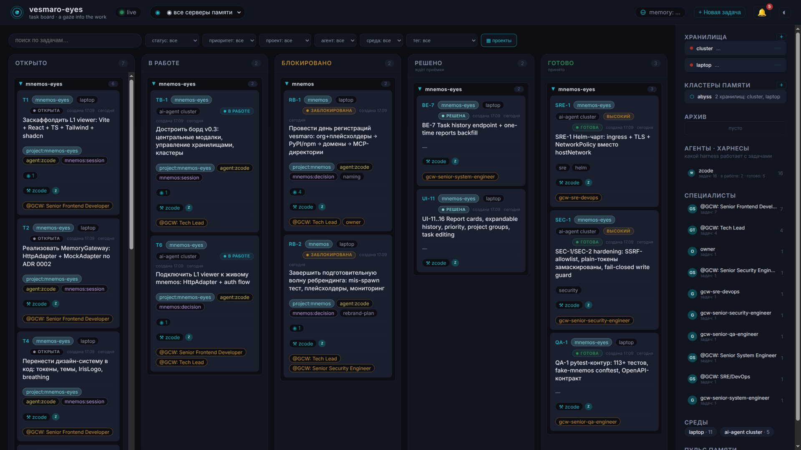
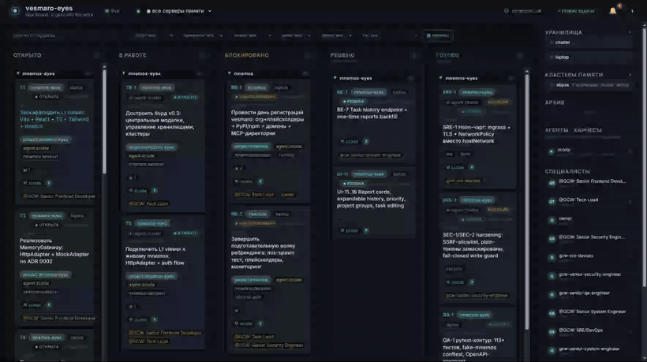
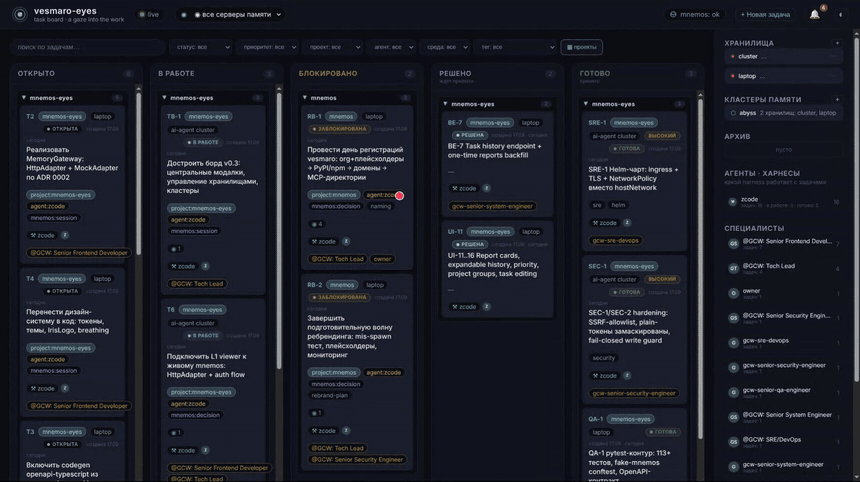
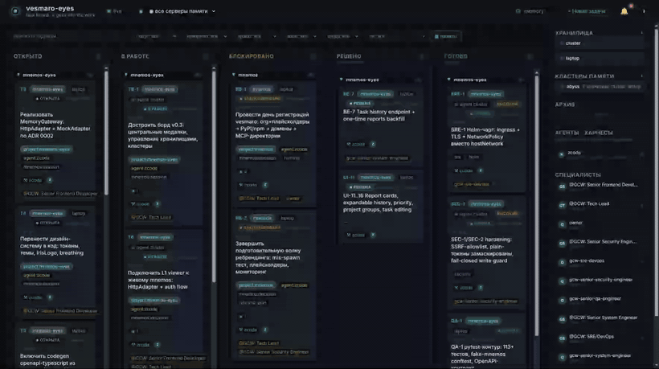
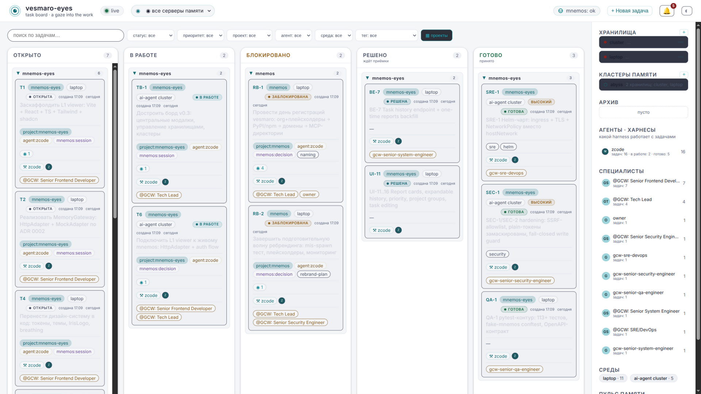
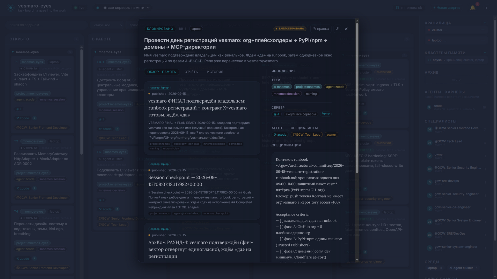
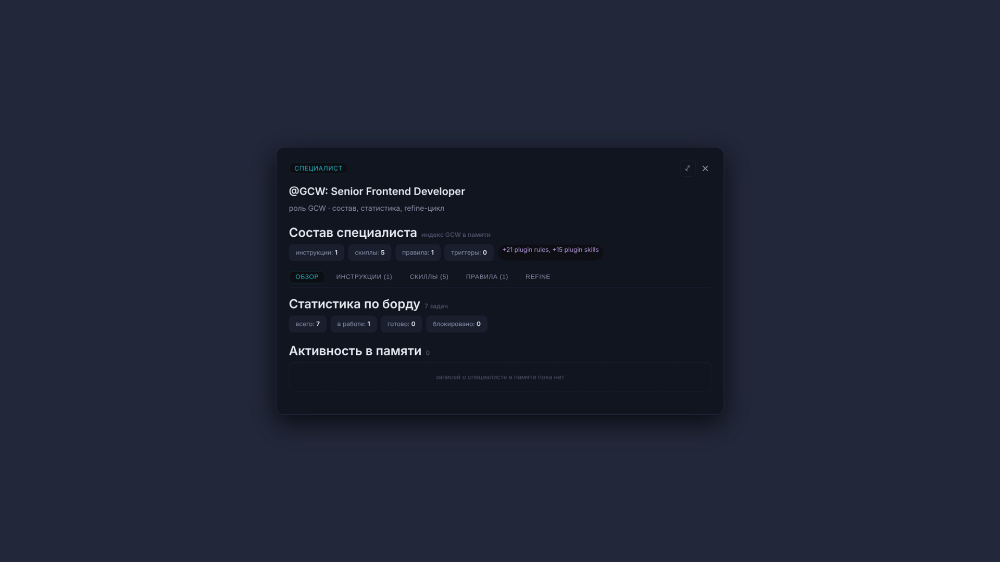
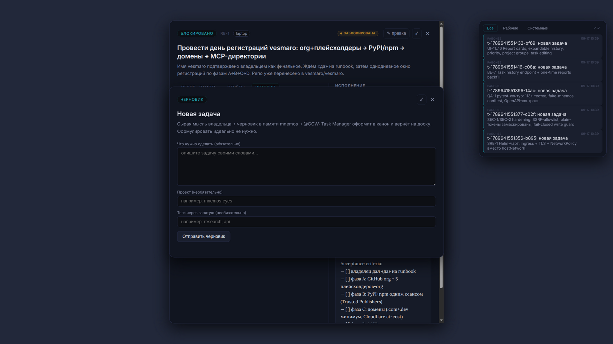
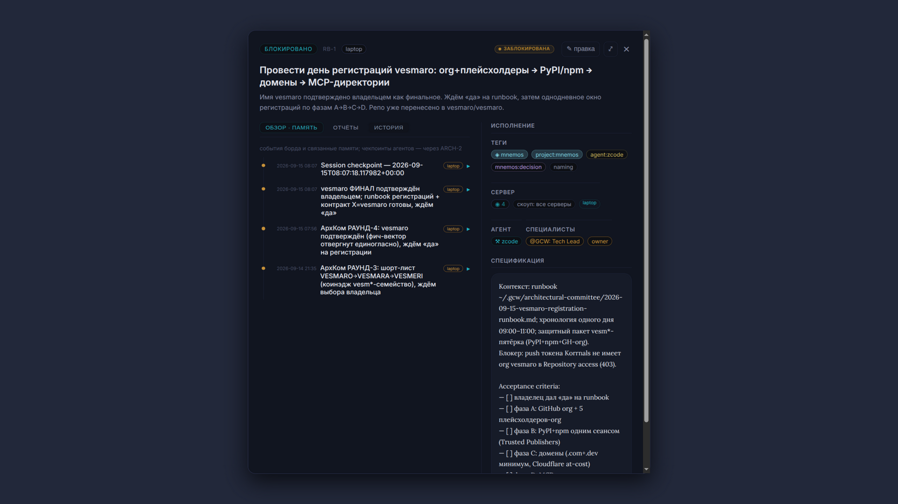
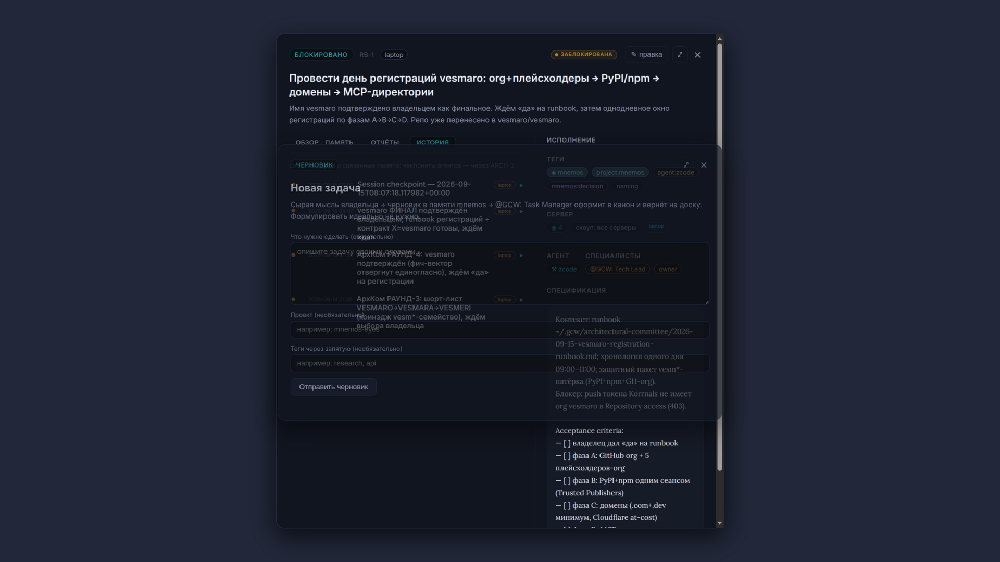

# vesmaro-eyes

> _«Взгляд в себя — в свои мысли.»_ — the eyes gazing into the well of memory.

**vesmaro-eyes** is the operational cockpit and GUI companion for the
[**mnemos**](../mnemos) long-term memory engine. Where the engine is the
well (storage, search, MCP, provenance), **vesmaro-eyes is the eye that
looks into it** — and the cockpit that steers the work: a live task board
wired to real agent memory.

<p align="center">
  
</p>

---

## How it works

Drag & drop a card — the board moves the task through the mnemos workflow
state machine and broadcasts the change to every open tab over SSE:



Open a task — linked memories render as scrolls straight from the live
mnemos stores (with per-server provenance), the **История** tab assembles a
unified timeline from board events and memory:



Live updates without touching the page — another client (CLI, agent, second
tab) moves a task via the API and the board updates itself over SSE, with a
notification toast:



## The interface

| | |
| --- | --- |
| **Light theme** — same tokens, same breathing | **Task drawer** — linked memory scrolls from live stores |
|  |  |
| **Specialist cards** — composition from GCW plugins, refine loop | **Notification center** — working & system notifications, archive |
|  |  |
| **Task history** — unified board + memory timeline | **New task** — form with pinned tags (board-reflect contract) |
|  |  |

## What it does

- **Task board** — kanban columns mirroring the mnemos workflow state
  machine (`open → in-progress → blocked → resolved → done`), drag & drop,
  filters (status / priority / project / agent / env / tag), project
  grouping, SSE live updates across all open tabs.
- **Multi-server memory** — connect several mnemos engines (cluster,
  laptop, remote…) and browse them **individually or merged into memory
  clusters** (groups). Every pulse item and search hit carries a
  per-server provenance badge; offline servers degrade honestly (red dot,
  «недоступен»).
- **Task cards** — agents (harnesses), execution environments,
  specialists, linked memories rendered as scrolls straight from the live
  stores, unified history timeline, memory search and attach.
- **Tag drill-down** — click any tag to see every task and memory tied to
  it, across all connected servers.
- **Specialist cards** — composition indexed from GCW plugins
  (instructions / skills / rules / triggers), refine loop with
  @GCW: Agent Architect.
- **Notification center** — working (task lifecycle) and system (store
  ops) notifications, archive with project grouping.
- **Context menus** everywhere, honest status indicators, dark & light
  themes, reduced-motion support.

> Design lore: _obsidian well_ — teal iris gaze, Lora for memory content,
> the interface quietly breathes. See [`docs/design-system.md`](docs/design-system.md).

---

## Quick start

The image is public on ghcr — no login needed:

```bash
docker pull ghcr.io/korrnals/vesmaro-eyes:latest   # or pin :1.2.0
```

### Docker Compose (simplest)

```bash
# 1. clone
git clone https://github.com/Korrnals/mnemos-eyes.git && cd mnemos-eyes

# 2. point it at your mnemos server + token
export MNEMOS_URL=http://your-mnemos-host:8787
export MNEMOS_TOKEN=mnk_...   # a mnemos API token (totp_required=0)

# 3. up (pulls ghcr.io/korrnals/vesmaro-eyes:latest)
docker compose up -d
# → http://localhost:8090
```

Podman works the same (`podman-compose up -d`). The board database lives
in `./data/` (bind mount) — survives rebuilds. On the first mutation the
UI asks for the write token (`VESMARO_BOARD_TOKEN`; the compose default is
a dev value — override it for anything beyond localhost).

One-liner without cloning:

```bash
docker run -d --name vesmaro-eyes -p 8090:8080 -v vesmaro-eyes-data:/data \
  -e MNEMOS_URL=http://your-mnemos-host:8787 \
  -e MNEMOS_TOKEN=mnk_... \
  -e VESMARO_BOARD_TOKEN=change-me \
  ghcr.io/korrnals/vesmaro-eyes:latest
```

### Kubernetes / K3s (Helm chart)

The chart lives at [`deploy/chart/vesmaro-eyes`](deploy/chart/vesmaro-eyes)
(ingress + TLS, chart-managed PVC, NetworkPolicy, auto-generated write
token; full ops runbook:
[`RUNBOOK.md`](deploy/chart/vesmaro-eyes/RUNBOOK.md)).

```bash
git clone https://github.com/Korrnals/mnemos-eyes.git && cd mnemos-eyes
kubectl create namespace vesmaro

# mnemos bearer token (mnk_..., totp_required=0) — never committed anywhere
kubectl -n vesmaro create secret generic vesmaro-eyes-mnemos \
  --from-literal=MNEMOS_TOKEN=mnk_...
```

`my-values.yaml` for a single-store install:

```yaml
imagePullSecrets: []            # the ghcr image is public

mnemos:
  cluster:
    url: http://mnemos.memory.svc:8787   # your mnemos service
  laptop:
    enabled: false              # second (LAN) store off; enable + secret to add

ingress:
  enabled: true
  className: traefik            # k3s ships traefik; set yours
  host: board.example.com
  tls:
    enabled: false              # or true + secretName with your cert

persistence:
  storageClass: local-path      # k3s default; remove for cluster default

# SEC-1: egress allowlist for memory-server hosts (extend when adding stores)
memoryHostsAllowlist: "mnemos.memory.svc,localhost,127.0.0.1"

# Seed the server registry on first boot (after that it lives in the DB)
memoryRegistry:
  configMap:
    create: true
    content:
      servers:
        - name: main
          url: http://mnemos.memory.svc:8787
          token_env: MNEMOS_TOKEN
          primary: true
```

```bash
helm install vesmaro-eyes deploy/chart/vesmaro-eyes -n vesmaro -f my-values.yaml

# write token for UI mutations — generated by the chart on first install
# (reused on every upgrade; survives uninstall)
kubectl -n vesmaro get secret vesmaro-eyes-board-token \
  -o jsonpath='{.data.VESMARO_BOARD_TOKEN}' | base64 -d
```

Notes for non-k3s clusters: the default NetworkPolicy admits ingress only
from a `traefik` pod in `kube-system` — adjust
`networkPolicy.ingress.traefik.{namespaceLabel,podSelector}` (or disable
`networkPolicy`) to match your ingress controller. The board DB rides a
PVC with `helm.sh/resource-policy: keep`, so `helm uninstall` never
garbage-collects your tasks.

---

## Connecting memory servers

The board watches **one or several mnemos engines**, individually or
merged into **memory clusters** (groups). Servers are managed in the UI
(rail → Хранилища → «+»); the registry lives in the board DB.

Token resolution per server: `env:<VAR>` → `file:<path>` → `plain:<token>`
(plain is deprecated — prefer env/file). Tokens never leave the server
and are never returned by the API.

See [`docs/sessions/SESSION-02-task-board-v0.md`](docs/sessions/SESSION-02-task-board-v0.md)
for the full runbook (token minting, LAN bind, troubleshooting).

---

## Architecture

```text
Browser SPA (vanilla ES modules, design tokens from docs/design-system.md)
        │  fetch + SSE
        ▼
FastAPI board server  ──  SQLite WAL on a mounted volume (/data/board.db)
        │  narrow proxy /api/memories/* (bearer mnk_… stays server-side)
        ▼
one or more mnemos HTTP APIs (8787/8788 …)
```

- Zero build step — `web/` is served as-is; edit and refresh.
- Multi-store merge, profile cache and scope switching live server-side
  (`server/app.py`); the browser never sees credentials.
- Two-frontend repo (ADR 0006): the operational board in `web/` (shipped
  in the image) and the read-only **L1 memory viewer** in
  [`viewer/`](viewer/) (Vite + React + TS, mock adapter out of the box).
- Design decisions: [ADR 0004](docs/decisions/0004-task-board-v0.md)
  (board pivot), [ADR 0005](docs/decisions/0005-harness-identity.md)
  (harnesses ≠ specialists), [ADR 0006–0008](docs/decisions/) — frontends
  fate, merged views vs mesh, backend stack.

## API (quick reference)

| Endpoint | What |
| --- | --- |
| `GET /api/board` | full board (columns, tasks, counts) |
| `POST/PATCH/DELETE /api/tasks…` | task CRUD + `/move`, `/archive`, `/unarchive` |
| `GET /api/tasks/{id}/history` | unified timeline (board events + memory) |
| `GET /api/memories/servers` | declared servers + groups + health |
| `GET /api/memories/pulse?scope=…` | merged pulse (all / group / server) |
| `GET /api/mnemos/search?q=…&scope=…` | merged memory search |
| `GET /api/tags/{tag}/drill` | tag drill-down (tasks + memories) |
| `GET /api/notifications` | notification center |
| `GET /api/events` | SSE stream (live updates) |

## Security posture

Designed as a **LAN-trust** tool: the board server is the only holder of
mnemos credentials; write-token gating (`VESMARO_BOARD_TOKEN`) and ingress
TLS are the pre-conditions for anything beyond a trusted LAN (see
[ADR 0004](docs/decisions/0004-task-board-v0.md) and the security review
findings in the tracker: SEC-1..4). Memory-server egress is allowlisted
(`VESMARO_ALLOWED_MEMORY_HOSTS`) so the board cannot be turned into an
SSRF pivot.

## Image & releases

Images for every release tag plus `latest` are published to ghcr
(public — no login needed):
[`ghcr.io/korrnals/vesmaro-eyes`](https://github.com/Korrnals?tab=packages).
The release workflow ([`.github/workflows/release.yml`](.github/workflows/release.yml))
builds, pushes and drafts GitHub Release notes on `v*` tags; the single
source of truth for the version is `FastAPI(version=…)` in
`server/app.py`, propagated by `scripts/sync-version.sh`.

## Docs

- 📜 [Charter](docs/CHARTER.md) · 🗂 [ADR log](docs/decisions/) ·
  🎨 [Design system](docs/design-system.md) · 🧭 [UI contract](docs/architecture/ui-contract.md)
- 🪵 [Session 02 — board build log](docs/sessions/SESSION-02-task-board-v0.md)
- 🚀 [Helm chart runbook](deploy/chart/vesmaro-eyes/RUNBOOK.md)
- 🏛 [Archcom session 1 protocol](docs/architecture/archcom-2026-09-16-archcom-session1.md)

## Ecosystem

```text
mnemos        → the memory engine (storage, API, MCP, traces)
mnemos-mesh   → cross-store federation (Go transport)
vesmaro-eyes  → the eye + the cockpit                       (this repo)
```

---

_The metaphor: **mnemos** = Mnemosyne, titaness of memory; **vesmaro** =
the product name (rebrand wave in progress); **eyes** = the gaze that
recollects — the iris breathes while you work._
