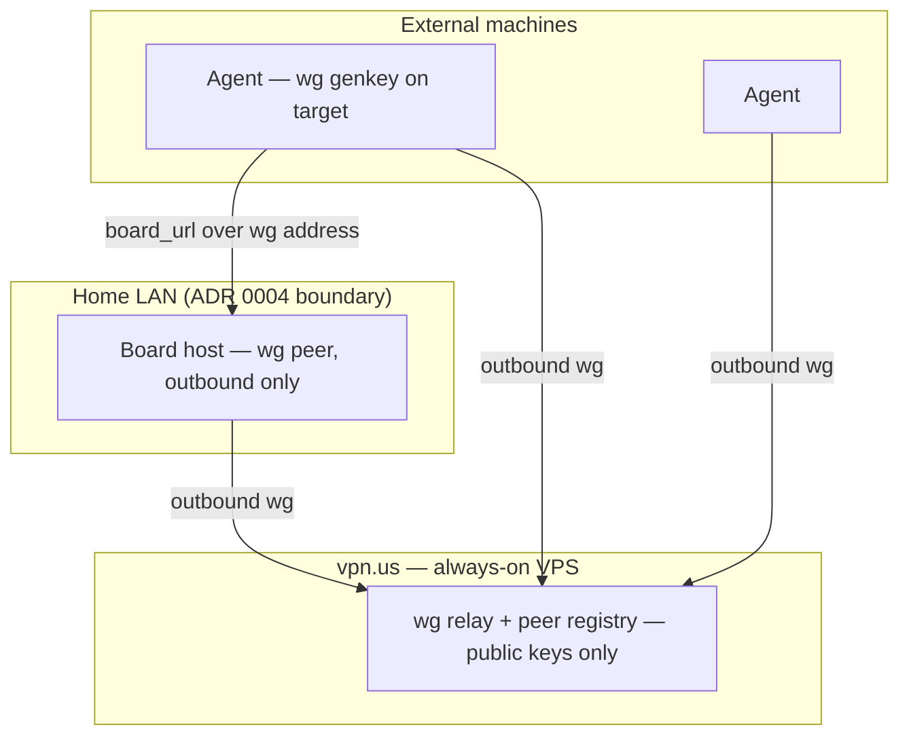

# ADR 0018: External-agent connectivity, installation trust anchor and release discipline

- Status: **Accepted** (АРХКОМ-8, 2026-09-23; consensus of all five
  specialists — criticism phase closed with AGREE, acceptance conditions
  folded into the contract; owner confirmation of the capacity-degradation
  window is a standing condition of the legacy migration)
- Deciders: Product Architect, Analytics Lead, Senior Security Engineer,
  Senior System Engineer, Senior SRE/DevOps; chaired and synthesised by
  `@GCW: Tech Lead`
- Related: ADR 0004 (task board v0 — LAN-trust boundary), ADR 0009
  (agent bridge — assignment queue), design doc
  [`../design/2026-09-23-connect-provisioning.md`](../design/2026-09-23-connect-provisioning.md)

## Context

Wave 4 delivered the Go agent, the provisioner and an E2E fleet node on an
external VPS (`vpn.us`, release 1.28.0). With the fleet real, four
architectural questions that the wave had parked came due at once.

**Manual installation is an unauthenticated root installer.** The documented
bootstrap is `curl -k | sudo bash`. The `-k` flag disables certificate
verification for seconds that include fetching both the script and the lab
CA; a MITM on the target's path gets root on the enrolling machine.

**External agents have no permanent path to the board.** The board is
LAN-bound by design (ADR 0004). Today's bridges are dead ends: routing
through the mesh hub does not work at all — there is no hub→LAN path
(verified fact, not a judgement call) — and the laptop reverse tunnel is a
SPOF whose uptime equals the uptime of a machine that sleeps.

**Releases are coordinated by luck.** Two agent sessions can deploy in
parallel; the rev.64-over-rev.63 incident plus a chart/appVersion desync
showed that last-writer-wins can silently roll back auth/TLS chart values.

**The onboarding journey promised is not the journey shipped.** The design
doc promised a token card, three fields and zero console for the owner.
Meanwhile the legacy Python poller still runs alongside the Go agent and
pollutes the assignment queue with refusal reports, so the honest journey
cannot even be measured.

## Decision

Four interlocking decisions, accepted as a package: the trust anchor for
installation, the target connectivity model, the single deploy door, and the
card-plus-retirement plan for the legacy poller.

### 1. Manual installation stays — anchored by `--expect-fp`

The copy-paste command produced by the token card embeds
`--expect-fp=<fingerprint of the lab CA>`. The fingerprint is public
material; argv is an acceptable carrier, the enrollment token stays in env.
Fallback hierarchy is fail-closed: `--expect-fp` on argv → prompt strictly
via `/dev/tty` (stdin is occupied by the pipe) → abort. Two-channel
verification by construction: the reference fingerprint lives on the browser
card (owner's channel), the CA being checked is fetched by the target
(target's channel) — a MITM must now win both channels.

Deletion gate: once the connection card is in production **and** the legacy
migration is complete, the manual path is removed entirely — the script, the
`/api/poller/bootstrap.sh` route, and the REMOTE-EXECUTOR.md section.
A signed installer (`minisign`/`signify`) is the candidate for the next wave
and closes the residual window below for good.

### 2. Target connectivity: outbound WireGuard star via `vpn.us`

All connections are outbound from the board and the fleet nodes to a relay
on the always-on VPS; the board accepts traffic **only** on the wg
interface. Publishing the board — including a DNAT port on the VPS — is
rejected outright. The trust boundary becomes cryptographic, not
topological, which strengthens the LAN-trust model of ADR 0004 instead of
punching through it.

Key handling is one-directional by design: private keys are generated on the
target (`wg genkey`), never leave the machine, are not backed up (loss =
re-enroll); the board and the relay store public keys only; revocation is
removing the peer from the registry. The provisioner is extended to install
wg as part of enrollment; the agent itself does not change (`board_url` and
`ca_bundle` are already configurable).

Interim state (until the star ships): a hardened reverse-tunnel systemd unit
on the laptop (`ExitOnForwardFailure=yes`, `Restart=always`, dedicated key,
`PermitListen` on the VPS), explicitly marked interim, with an SLI on the
duration of the transition window.

### 3. Release discipline: `scripts/deploy.sh` is the only door to prod

A single wrapper serializes releases mechanically instead of by convention.
Gates, in order: `git fetch` + HEAD == origin/main + clean tree;
`sync-version.sh --check`; `flock` on a stable lock path
(`/run/vesmaro-deploy.lock`); helm history gate (previous revision must be
`deployed`, not `failed`/`pending-upgrade`); chart security-values drift
check against git, failing closed (only non-secret flags reach the output);
`helm upgrade --atomic`; then an append-only line in `deploy/JOURNAL.md`
(date, who, revision, tag, chart, worktree hash). Rollbacks go through the
same wrapper. One session deploys at a time; handover is a marker line in
the JOURNAL. The one-shot chart/appVersion repair happens **before** the
history gate is enabled, through the wrapper, with rollback semantics
verified on a test release.

### 4. Connection card in parallel; legacy poller retired in stages

The card is built in parallel and stays transport-agnostic — its data model
reserves a slot for the connectivity profile, so the wg star of Decision 2
is an addition, not a rewrite. Three fields, zero console:
`--url`, one-shot `mne_…` token, name/harness. A password field does not
exist. Approving a new TOFU pin is a paste-back of the last 8 hex digits of
the fingerprint from the target (anti-habituation); re-approving an already
pinned host requires no re-check.

The legacy Python poller is retired in stages, not by immediate stop:
fix M1/M3 baselines from board-event history **before** touching anything →
disable the legacy executor (refusal-report noise stops immediately,
capacity returns via migration) → run the Go agent in parallel as a separate
`executor_id` → stop criterion: 48h of clean heartbeats → stop the poller.

## Consequences

Positive:

- Cryptographic trust boundary instead of topology: per-identity tunnels,
  individual revocation, outbound-only by construction — a strict
  strengthening of ADR 0004.
- An honest onboarding journey becomes measurable: M1 time-to-first-done
  < 15 min, M2 = 0 owner steps, M3 ≥ 80% first-pass success.
- Reproducible prod state: one deploy door, no silent rollbacks of
  auth/TLS values, an audit trail in the JOURNAL.
- Noise leaves the assignment queue as soon as the legacy executor is
  disabled, not when the migration finishes.

Negative / accepted risks:

- Residual `-k` window: the first fetch of `bootstrap.sh` itself can still
  be substituted until the signed-installer wave; the CA check
  (`--expect-fp`) covers everything the script then fetches.
- `vpn.us` becomes a critical dependency (SPOF of the route). Mitigated by
  monitoring handshake-age per peer, relay probes and heartbeat-age SLI —
  an always-on VPS is measurable and recoverable, unlike a sleeping laptop.
- Capacity-degradation window during the legacy migration: the laptop takes
  no tasks from `disable` until the Go agent's first `done`. The committee
  judged refusal noise worse than brief capacity loss; **the window requires
  owner confirmation** (standing condition of the contract).
- "Interim" reverse tunnel becoming permanent: made visible by an SLI on
  the window duration; invisible transitions do not close themselves.

## Alternatives considered

| Alternative | Why rejected |
| --- | --- |
| Two-step CA download as the primary fix for В1 | Security theater — the CA arrives over the same unverified channel; the anchor must be an out-of-channel value on the card |
| Hub routing / forwarder on the mesh hub (В2) | No hub→LAN path exists (verified fact); routing would also mean an L3 pivot from the VPS into the home segment |
| Publish the board, incl. a DNAT port on the VPS (В2) | Exposes the board API without compensating controls; breaks the ADR 0004 LAN-trust boundary |
| Board-side wg key issuance (В2) | A board dump would disclose every agent identity at once — annihilates per-peer blast radius |
| Immediate poller stop, migrate later (В4) | Capacity loss while the Go agent is unsoaked on the laptop; replaced by disable + migrate-alongside |
| Dedicated deploy role / account (В3) | Overkill for a single-host cluster; `flock` on a stable path closes the same race |
| Formal multi-step release protocol (В3) | Process overhead; the wrapper enforces the same steps mechanically and cannot be skipped |
| Do nothing on releases (В3) | The rev.64-over-rev.63 incident confirmed the cost: unserialized deploys with silent chart-value rollbacks |

## References

- Committee protocol (АРХКОМ-8, 2026-09-23):
  `~/.gcw/architectural-committee/2026-09-23-archcom-8-wave4-connectivity-installation-releases.md`
- Architecture contract:
  `~/.gcw/architectural-committee/2026-09-23-archcom-8-wave4-connectivity-installation-releases-contract.md`
  (team-local files, not in git)
- Mnemos: decision id `18a71f2f` (АРХКОМ-8), contract id `3674cc5e`
- ADR 0004 (`0004-task-board-v0.md`) — LAN-trust boundary this ADR strengthens
- ADR 0009 (`0009-agent-bridge-assignments.md`) — assignment queue and poller
- Design doc: `docs/design/2026-09-23-connect-provisioning.md` — the promised
  card/3-fields/zero-console journey
