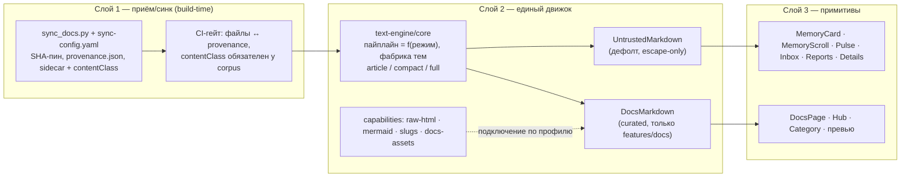

# ADR 0020: Единый текстовый движок — слои приёма и рендера, профили доверия, конвергенция Ф0–Ф3

- Status: **Accepted by committee — pending owner ratification**
  (АРХКОМ 2026-09-24; позиции всех четырёх специалистов — «условно»,
  условия синтезированы председателем и приняты целиком)
- Deciders: Product Architect, Analytics Lead, Senior Security Engineer,
  Senior System Engineer; вёл и синтезировал `@GCW: Tech Lead`
- Related: ADR 0016 (импорт апстрим-доков — его sync-пайплайн становится слоем L1),
  ADR 0017 (паритет рендера docs — sanitize-схема и mermaid-контракт переезжают
  в curated-профиль без изменений), ADR 0018 (фазовые гейты и откатываемость —
  процессный образец), architecture note
  [`../architecture/markdown-rendering.md`](../architecture/markdown-rendering.md)
  — её раздел «Конвергенция» снят с паузы этим ADR

## Context

Директива владельца (2026-09-24): **один текстовый движок для всех текстов и
документов** — один рендер вместо двух параллельных react-markdown конвейеров.
Директива принята как целевая архитектура; конвергенция из
`markdown-rendering.md` снимается с паузы и выполняется по фазам.

История вопроса: волна UI-27 (`components/TextEngine/`, недоверенный авторский
текст) и волна 1.27.0 (`features/docs/Markdown.tsx`, курируемый корпус, АРХКОМ-8)
независимо построили два конвейера — примерно 70% кода конвейеров скопировано.
Заметка `markdown-rendering.md` зафиксировала границы «чтобы третьего не
появилось», но дрейф уже живой: ~160 строк hast-утилит скопированы вербатим,
и оба конвейера делят **один** vendor-чанк `docs-render` (regex пулов в
`vite.config.ts`) — TextEngine переплачивает за sanitize-стек, который не
исполняет (комментарий «~48KB» в коде устарел; актуальный замер пула —
103.2 KiB gzip, ADR-0017).

Два недавних дефекта (баннер, mermaid-фолбэк) — дефекты **детекционного** слоя,
а не рендера: браузерного рендер-смоука в CI нет вообще (прямой долг ADR-0017 —
«нужен browser-e2e смоук: фенс на странице → `<svg>` в DOM»), юнит-тесты
добросовестно мокают mermaid, поэтому оба дефекта доехали до прод-скриншотов
владельца. ME-009 (баннер в описаниях категорий — strip-хелпер заякорен на
строку 0) и ME-010 (литеральные `\n` в mermaid-лейблах роняют parse в фолбэк)
— дефекты командного трекера (team-local, в git не входят); без смоука
следующий такой дефект обнаружится тем же способом.

## Decision

Три слоя; доверие — свойство канала доставки, выбирается **кодом** (импортом
обёртки), fail-closed; рантайм никогда не поднимает trust.

### Слой 1 — приём/синк, только build-time

`sync_docs.py` ставит штамп `contentClass: "corpus"` на каждую страницу
sidecar (сейчас `kinds` неравномерен — штампуется только перевод). Отсутствие
штампа или ошибка = недоверенный профиль (fail-closed). CI-гейт сверяет
множество файлов корпуса с `provenance.json` — orphan/ручная посадка файла
краснит билд. Штамп — **верификация целостности канала** в CI, НЕ рантайм-
переключатель профиля. Рантайм-приёмка docs-контента из сети запрещена:
это смена trust-границы и предмет отдельного архкома.

### Слой 2 — единый движок и профили доверия

`text-engine/core` — единственная точка входа рендера: сборка пайплайна как
функции от режима, одна копия hast-утилит, мемоизированная фабрика тем
(`article` — нынешняя типографика docs, `compact`, `full` — нынешний TextEngine).
Профиль выбирается **импортом обёртки**, не пропом и не данными:

| Профиль | Обёртка | Где разрешён импорт | Способности |
| --- | --- | --- | --- |
| `untrusted` (дефолт) | `UntrustedMarkdown` | везде (примитивы) | escape-only: без rehype-raw; href/src ∈ http(s)/mailto; чекбоксы disabled; mermaid-фенс = инертный код-блок; без id/name/slugs |
| `curated` | `DocsMarkdown` | только `features/docs/**` (ESLint-грейплист) | = untrusted + raw-HTML (rehype-raw → subtree-drop → rehype-sanitize, единая схема) + mermaid (strict, lazy) + heading-slugs + docs-assets/links |

raw-HTML, mermaid, heading-slugs, docs-assets — capability **только
curated-профиля**; на недоверенных поверхностях они инертны (нынешнее
поведение TextEngine сохраняется). Safe-links доступны обоим. «Curated» —
выверенный **канал приёмки**, а не дружелюбный контент (supply-chain
апстрима — OWASP A08), поэтому sanitize-гейт один, схема одна и применяется
всегда, в обоих профилях. Расширение схемы — только governance-PR с
hostile-набором (прецедент АРХКОМ-8 / ADR-0017).

**Markdown.tsx не удаляется**: он остаётся docs-конфигурацией и единственным
curated-call-site sanitize — точкой ревью схемы и ESLint-контракта. Ф3 удаляет
**дублирование** (копипасту утилит), не файл.

### Слой 3 — примитивы

Потребители (`MemoryCard`, `DocsPage`, отчёты, инбокс) не знают о пайплайне:
импорт обёртки и есть решение о доверии. Barrel `TextEngine/index.ts`
не экспортирует рендерер статически (контракт ленивости сохраняется).

### Инварианты (проверяемые)

1. Один sanitize-гейт, одна схема, один снапшот-тест; ESLint
   no-restricted-imports держит единственность точек rehype-raw / mermaid /
   react-markdown на весь `src`.
2. Золотой XSS-корпус (hostile.md + memory-векторы: `data:`/`vbscript:`/регистр
   схем/svg-use/form/гигантские фенсы) прогоняется через **оба** профиля:
   curated → sanitized, untrusted → литеральный текст.
3. Architecture-тест: untrusted-модули не импортируют capability-модули;
   curated-обёртка импортируется только из `features/docs` (грейплист).
4. Контент-контролируемых ключей способностей не существует: `trust`/
   `capabilities` в frontmatter/sidecar/API парсеры игнорируют.
5. `resolveDocLink`/`resolveDocImageUrl`/slugs недоступны недоверенному профилю.
6. `style`-атрибуты, `id`/`name` из контента, кликабельные `<a>` в SVG не
   возвращаются никогда (residual risk ADR-0017).
7. Браузерный рендер-смоук (долг ADR-0017): хаб/категория/страница/mermaid-фенс/
   details-provenance — DOM-ассерты, гейт PR; расширяется на все поверхности
   при конвергенции.

### Фазы и гейты

| Фаза | Объём | Гейт приёмки | Откат |
| --- | --- | --- | --- |
| Ф0 (0.5 волны, можно сразу) | Юнит-золотые (HTML-снапшоты обоих конвейеров на представительном корпусе + hostile); браузерный рендер-смоук (инвариант 7); `contentClass` в `sync_docs.py` + CI-гейт | смоук покрывает 100% doc-поверхностей; числа бюджетов зафиксированы | не нужен (аддитивно) |
| Ф1 (1 волна; старт после приземления docs-волн соседней сессии) | экстракция `text-engine/core`; первый потребитель — TextEngine/MarkdownView; Markdown.tsx не тронут | нулевой поведенческий дифф: пер-поверхностные `*.markdown.test.tsx` без правок; entry ±0; vitest-набор зелёный | revert одного мержа |
| Ф2 (1 волна) | `DocsMarkdown` = тонкая обёртка ядра (call-site sanitize остаётся здесь); расщепление чанка `docs-render` → `md-core` + `md-sanitize` + апдейт бюджет-гейта; срез баннеров — в сборку манифеста/выдержек | hostile-фикстуры зелёные на обёртке; docs-смоук зелёный; бюджеты по новым пулам | revert обёртки к автономному файлу |
| Ф3 (0.5 волны) | удаление копипасты утилит; `markdown-rendering.md` → архивная заметка «один конвейер, два профиля»; ре-бейзлайн бюджетов; золотые — CI-блокирующие | grep дублей пуст; владелец прошёл джурни (доки → память → задача → инбокс → отчёт → пульс) со скриншотами | — |

Ф1 и далее стартуют только после приземления активных docs-волн соседней
сессии; Ф0 состоит из дизъюнктных файлов и может идти сразу. Владелец ядра
и фабрики тем — один (tech lead); способности входят только через
governance-PR.

## Alternatives rejected

| Альтернатива | Почему отклонена |
| --- | --- |
| Один компонент с рантайм-пропом trust | Точка подделки штампа (CWE-349/283); проп копируют, забывают, передают из данных |
| Статус-кво (два конвейера) | Директива владельца = «выстрел триггера» из markdown-rendering.md; живой дрейф: ~160 строк копипасты, двойная оплата одного vendor-чанка |
| Слияние sanitize-схем / «доверенный = без защиты» | Либо XSS на недоверенном, либо потеря GitHub-parity доков (ADR-0017); supply-chain апстрима не позволяет делить схему по доверию контента |
| Рантайм-загрузка доков из сети (слой 1 шире build-time) | Смена trust-границы: доверие перестаёт проверяться на билде — отдельный архком при спросе |
| Удаление Markdown.tsx в Ф3 | Размывает единственность call-site sanitize и ESLint-контракт; Ф3 удаляет копипасту, не файл |
| Всё одним куском без фаз | Бюджетные гейты ADR-0015/0017 уже ловили mega-chunk; пошаговость = откатываемость |

## Consequences

- **Расщепление бандла**: недоверенный путь перестаёт платить за
  sanitize-стек — сегодня оба конвейера едут в одном vendor-чанке
  `docs-render`. После Ф2: `md-core` (react-markdown + remark-gfm,
  ~48–55 KiB gz) + `md-sanitize` (+25–40 KiB gz, только curated-путь);
  mermaid остаётся lazy и strict, как в ADR-0017.
- **ME-009/ME-010 остаются срочными фиксами** и вердикт-совместимы: ME-009
  чинит excerpt-путь (в Ф2 он переезжает в сборку манифеста — умирает класс
  дефекта), ME-010 чинит слой L1 (нормализация `\n`-литералов при синке
  апстрим-корпуса). Оба фиксируются в текущем двухконвейерном режиме.
- **ME-011** (Ф0: золотые фикстуры + рендер-смоук + contentClass-гейт)
  регистрируется в командном трекере; Ф1+ — после приземления docs-волн
  соседней сессии.
- **mermaid на недоверенных поверхностях** (отчёты агентов) — за горизонтом
  1.x, единогласно: клиентская DoS-поверхность (CWE-400) плюс XSS-история
  библиотеки; при спросе — opt-in с размерными лимитами и отдельный архком.
- **Координация с docs-сессией**: до приземления её волн docs-домен не
  трогается (Ф0 — дизъюнктные файлы); API TextEngine заморожен с Ф1.
- Попутные «улучшения» типографики в конвергентных PR запрещены — одна
  фабрика тем, снапшот-тест дрейфа классов.

## References

- Протокол комитета: `2026-09-24-unified-text-engine.md` (team-local,
  `~/.gcw/architectural-committee/`, в git не входит).
- Архитектурный контракт: `2026-09-24-unified-text-engine-contract.md`
  (team-local, в git не входит).
- ADR 0016 (`0016-docs-upstream-import.md`) — слой L1 растёт из его
  sync-пайплайна (SHA-пин, provenance, sidecar).
- ADR 0017 (`0017-docs-rendering-parity.md`) — sanitize-схема и mermaid-контракт
  переезжают в curated-профиль без изменений; его браузерный смоук-долг
  закрывается в Ф0.
- ADR 0018 (`0018-connectivity-installation-release-discipline.md`) —
  процессный образец фазовых гейтов и откатываемости.
- `docs/architecture/markdown-rendering.md` — двухконвейерный режим
  (транзитный); его раздел «Конвергенция» исполнен этим ADR.
- Дефекты ME-009/ME-010/ME-011 — командный трекер
  (`~/.gcw/tasks/mnemos-eyes/tasks.yaml`, team-local, в git не входит).
- Факты реализации: `viewer/src/components/TextEngine/`,
  `viewer/src/features/docs/Markdown.tsx` + `sanitizeSchema.ts`,
  `viewer/vite.config.ts` (пул `docs-render`),
  `viewer/scripts/budget-docs-render.mjs`, `scripts/sync_docs.py`.