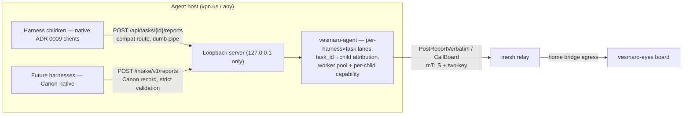

# ADR 0021: Native intake contract for agent v2 — dual-mode loopback, Canon reports, attribution and backpressure

- Status: **Accepted** (АРХКОМ-9, 2026-09-26; convergence of all four
  specialists without objections — the criticism phase was folded in via
  cross-briefing. Standing conditions: Canon mandatoriness on the native
  channel activates upon ratification of `vesmaro-canon-archcom-v1`;
  v0.6 is gated by metrics that are defined and emitted already in the
  v0.5 acceptance)
- Deciders: Product Architect, Analytics Lead, Senior Security Engineer,
  Senior System Engineer; chaired and synthesised by `@GCW: Tech Lead`
- Related: ADR 0009 (`0009-agent-bridge-assignments.md` — §7 reports
  discipline, §9 security contract), ADR 0018
  (`0018-connectivity-installation-release-discipline.md` — connectivity
  provisioning this intake runs on), the agent protocol's §2.8 mesh
  addendum (`vesmaro-agent/docs/PROTOCOL.md`, AGW-18), vesmaro-canon
  (spec-only repo, canon v0.1 Proposed)

## Context

The mesh transport is in battle: the agent runs on an external machine and
reaches the board only through the mesh relay. The live §5.3 pilot proved
harness children post reports natively over the ADR 0009 wire
(`POST /api/tasks/{id}/reports`, Bearer `VESMARO_BOARD_TOKEN`), but behind
the relay the board is unreachable — so the agent runs the loopback board
shim of the §2.8 mesh addendum. Shim v0.4.0 (compat mode) is built,
reviewed and accepted: exactly one routed route, board statuses relayed
verbatim, the child credential-free by construction.

**The structural gap.** ADR 0009's report leg physically cannot carry what
agent v2 must deliver — streams and proofs — so the flagship
«synchronicity» journey (the owner journey AGW-14, "reports with proofs")
has no carrier on the compat channel. The board also enforces a budget of
30 reports / 60 s per task, and its 429 reaches the child verbatim today.

**The owner's principle** (2026-09-26): the agent is a representative of
vesmaro-eyes; harnesses are native and are not bent to fit an interface.
Children write to the agent "as into a cache", each into its own lane; the
agent processes in parallel and delivers over the mesh with attribution.
Everything a child cannot know is absorbed by the agent — never pushed
into the harness.

**Ready material.** vesmaro-canon (spec-only) already ships the
report/envelope schemas (JSON Schema draft 2020-12, envelope at
`metadata.canon` + free-form `body` with `x-canon-sections` H2 headers)
and a validator, formats frozen until 6.0. Attribution inputs exist
without child participation: a spawn registry maps `task_id → child`.
One constraint closes the shortcut of teaching children Canon inline: the
assignment envelope's REPORTS block is frozen byte-parity, so Canon hints
travel only via the task text or a versioned addendum.

## Decision

We run **two intake modes on the same loopback server** and make **Canon
the mandatory format of the native channel**, phased so that the v0.6
backpressure move is measured, never guessed.

### 1. Dual-mode intake (В1)

The compat HTTP route of ADR 0009 / §2.8 stays a **dumb pipe**,
byte-for-byte: board statuses relayed verbatim (201 / 404 / 422 / 429), an
honest 503 on a down relay leg, and a local 413 when a body exceeds the
1 MiB relay cap (`MaxShimBodyBytes`, `internal/board/shim.go`). The board
remains that route's sole validator.

A second, native route `POST /intake/v1/reports` on the same loopback
listener carries a **Canon record in the body** (envelope + body) with
strict validation at the edge. The agent-representative normalizes the
fields a child cannot know — the tag triple, `period`, `language`,
`title` — **before** validation; a payload that still fails is
dead-lettered and the child receives an honest rejection.

Deprecation of the compat route is out of scope: the agent-representative
serves both classes of children.

### 2. Phases v0.5 / v0.6, gated by metrics (В2)

| Phase | Scope | Gate |
| --- | --- | --- |
| v0.5 | Native `/intake/v1/reports` + Canon validation (go:embed pin) + attribution/pool + per-child capability + metrics (including the v0.6 gate metrics) + dead-letter base (masking, 0600, TTL) | Live e2e: native report through the mesh; capability test; dead-letter test |
| v0.6 (metric-gated) | Per-task token bucket, aggregation of intermediate reports (last-wins progress / batch milestones), dead-letter rotation | v0.5 metrics (validated share, reports/s) |
| Canon gate | Mandatoriness of the Canon format activates upon ratification of `vesmaro-canon-archcom-v1` | Their archcom session |

v0.5 mechanics, accepted as a package:

- **Attribution without child participation:** `task_id → child` resolved
  from the spawn registry (plus a grace window after child death); a
  `task_id` outside the registry → 404, matching board semantics.
- **Per-child capability:** an unpredictable per-child prefix in
  `VESMARO_BOARD_URL`; an unknown caller → 404 before the body is read.
  Loopback today trusts any local process (CWE-346); capability closes
  anonymous writes.
- **Lanes and pool:** per-task lane (capacity 1–2, serial worker = per-task
  FIFO) plus a global semaphore (~8) on relay calls, so one noisy task
  cannot eat the mesh leg (CWE-770). Drops are visible, never silent:
  `dropped-by-backpressure > 1%` alerts.
- **Metrics emitted in the v0.5 acceptance include the v0.6 gate metrics**
  (validated share, reports/s per task, dead-letter rate,
  dropped-by-backpressure, time-to-visible p95 < 60 s) — otherwise the
  v0.6 move is unfalsifiable.
- **v0.6 moves by metrics, not by calendar.**

### 3. Canon report-schema — mandatory format of the native channel (В3)

- Validator: `santhosh-tekuri/jsonschema/v6` (draft 2020-12) with
  **go:embed-pinned schemas** — a vendored copy + checksum + a CI check
  that the pin equals canon HEAD; `$ref`s resolve locally (offline);
  network fetch at validation time is forbidden. Only the three proven
  checks port from canon's `validate.py`: schema-pass + `x-canon-sections`
  + title; the canon examples corpus is the shared fixture set.
- **Strict is the default.** A soft mode exists only as a rollout window
  with an explicit expiry date; the Analytics gate is validated share
  ≥ 90% over two weeks — after that, non-validating traffic is rejected
  (ladder: normalize → warn → reject).
- On the compat channel the same metric doubles as the migration baseline:
  it measures what share of free text already passes Canon as-is.
- Mandatoriness activates upon ratification of `vesmaro-canon-archcom-v1`
  (canon v0.1 is still Proposed; ratification changes the document's
  status, not the formats — v1 = v0.1 proven by practice).
- `proofs[]` remains an optional field (a future ADR decides); it is not
  made mandatory before 6.0.

### 4. Validation boundaries — strict only at the native edge (В4)

- The compat route is a dumb pipe: **the board is its sole validator**.
  Validating twice would create two executors of one contract — allowed
  only on the shared corpus, not as divergent rules.
- **Dead-letter is a working queue of the agent-representative, not a
  graveyard**, with hygiene from day one: JSONL in the state-dir, `0600`
  files / `0700` dirs, **secrets masked before write** (children are
  arbitrary LLM code — the payload is raw bytes of untrusted output), TTL
  + size limit, replay manual only. It is visible to the agent and its
  volume feeds the v0.6 gate; dead-letter > 10%/day signals a broken
  contract, and dead-lettered payloads stay in the SLI denominator.
- **Schema ≠ trust.** Validation is a format contract, not content trust:
  `body` is a free string and XSS (CWE-79) on the board is not closed by
  intake validation — default escaping + CSP on the vesmaro-eyes render
  side (a separate board plan).

## Consequences

Positive:

- The native channel is the sole carrier of the flagship «synchronicity»
  v2 and of AGW-14 "reports with proofs" — ADR 0009's leg cannot hold
  streams or proofs.
- Harnesses are not bent: the owner's principle holds by construction, and
  the agent-representative absorbs the format difficulty (normalization
  before validation).
- Secret isolation is preserved and strengthened: the executor secret
  never leaves the agent; the child is credential-free by construction.
- Falsifiable phasing: v0.6 moves on metrics emitted since v0.5; drops and
  dead-letter volume are visible, nothing is silently lost.
- The compat channel doubles as a migration baseline: the measured share of
  free text that already passes Canon.

Negative / accepted risks:

| Risk | Mitigation | Residual rationale |
| --- | --- | --- |
| Loopback `task_id` forgery (CWE-345) | Per-child capability + task_id allowlist + audit of accept/reject | Loopback boundary + board gate + reports carry no state-machine levers; capability closes anonymity |
| `body` is a free string — XSS on the board (CWE-79) | Intake answers structure, not trust; escaping + CSP at board render (separate plan) | "Validated == safe" is the trap this split avoids |
| Canon schema pin drift | Vendored copy + checksum + CI check "pin == canon HEAD" | Schemas change only with an agent release |
| Dead-letter may contain child secrets | Masking before write, 0600/0700, TTL + size cap, manual replay | Payload is raw bytes of arbitrary LLM code |
| 1 MiB agent-leg cap on one call | Native intake is designed under it; honest local 413 | Chunking is a mesh-v2 topic, only if native load hits the cap |

## Alternatives considered

| Alternative | Why rejected |
| --- | --- |
| Local "mini-board" on the agent | Surface growth: the agent is a post server, not a copy of the board (owner) |
| Egress child traffic through the relay directly | Hands the executor secret to children; weakens relay isolation (SEC/PA) |
| stdout-only harness contract | Rewrites every harness — a dead end (owner) |
| Unix socket instead of TCP loopback | Does not protect against the same user's processes; the real control is capability (SEC; deferred to multi-user hosts) |
| Network fetch of canon schemas at validation time | Kills the agent's offline determinism (SEC/SE); schemas are go:embed-pinned instead |
| Immediate reject on the compat channel | Without baseline data an expiry date is a guess (AL); the ladder is normalize → warn → reject |

## Out of scope

Deprecation of the compat route; making `proofs[]` mandatory (not before
6.0); board render escaping/CSP (separate vesmaro-eyes plan); chunking
bodies over 1 MiB (mesh v2, if native load hits the cap); unix-socket
hardening (deferred to multi-user hosts); ratification of
`vesmaro-canon-archcom-v1` (their session).

## References

- Committee protocol (АРХКОМ-9, 2026-09-26):
  `~/.gcw/architectural-committee/2026-09-26-archcom-9-intake-contract.md`
- Architecture contract:
  `~/.gcw/architectural-committee/2026-09-26-archcom-9-intake-contract-contract.md`
  (team-local files, not in git)
- Mnemos: decision id `83eddf31` (АРХКОМ-9, tags `project:mnemos-eyes`,
  `mnemos:decision`, `committee`); superseded queue id
  `2d017cac-3131-4787-8865-00e4fcdaa2f8`
- ADR 0009 (`0009-agent-bridge-assignments.md`) — §7 reports discipline
  (children post natively), §9 security contract
- ADR 0018 (`0018-connectivity-installation-release-discipline.md`) —
  connectivity provisioning the intake runs on
- `vesmaro-agent/docs/PROTOCOL.md` §2.8 — mesh addendum: loopback shim,
  child env (`VESMARO_BOARD_URL` without a token), verbatim statuses
- `vesmaro-agent/internal/board/shim.go` — shim v0.4.0 (compat mode),
  `MaxShimBodyBytes` = 1 MiB
- vesmaro-canon (spec-only): `docs/canon.md` §10 (freeze until 6.0,
  ratification semantics), `schemas/report.schema.json`
  (`x-canon-sections`, envelope at `metadata.canon`)