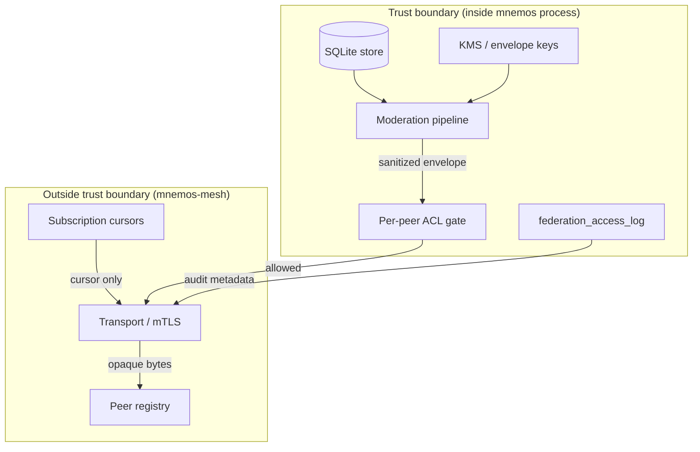
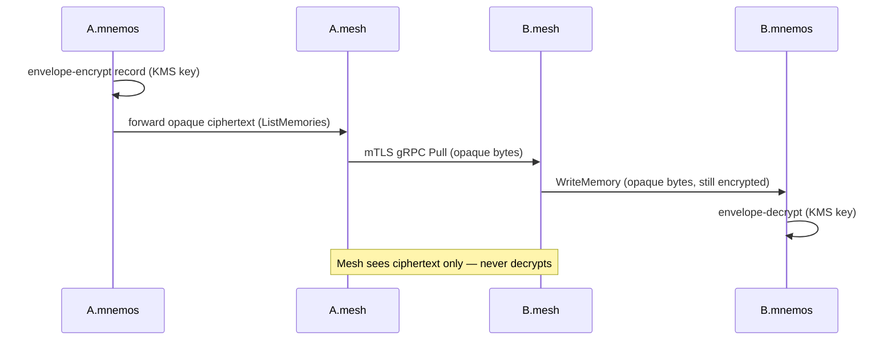

<!-- GENERATED by sync_docs from mnemos-mesh@331ef3a785c1 — правки через sync-config.yaml overlay -->

> Куратор: модель доверия меша — «глупый транспорт», mTLS, per-peer ACL и ключи; то, что оператор узла обязан настроить.

# Security model for mnemos-mesh operators

mnemos-mesh is a **dumb transport**. It sits outside the mnemos trust
boundary: it never decrypts, never moderates, never stores content.
This guide covers the trust boundary, mTLS setup, per-peer ACL, and
key management an operator needs to deploy the mesh safely.

> **Audience:** operators deploying a federation peer. For the full
> threat model, see ADR-0016 in the mnemos repo
> (`mnemos/docs/project/adr/0016-federation-threat-model.md`). For the
> architecture, see [../architecture.md](https://github.com/Korrnals/mnemos-mesh/blob/331ef3a785c1a74fb9f8972ff93cd6db5a8fc174/docs/architecture.md).

---

## 1. Trust boundary

The mesh lives **outside** the trust boundary (criterion 10).
Everything that can decrypt, decide, or persist content stays inside
mnemos.



### Inside the trust boundary (mnemos owns)

| Component | Authority | Criterion |
|---|---|---|
| SQLite store | Only mnemos reads/writes it directly | 6, 11 |
| KMS / envelope encryption keys | Never leave mnemos; mesh has no key material | 1, 4 |
| Moderation pipeline (secrets detector, PII scrubber, neutral-value replacement) | Runs in Python on export and on pull; mesh never runs it | 2 |
| Per-peer ACL gate (projects/types/tags) | Evaluated by mnemos against `peer_id` + `project_scope`; mesh just carries the fields | 5 |
| `federation_access_log` (B-side audit) | Written by mnemos; mesh forwards pointer (`access_log_entry_id`) only | contract §10 |

### Outside the trust boundary (mesh owns)

| Component | What it holds | What it does NOT hold |
|---|---|---|
| Peer registry | Peer ids, addresses, pinned fingerprints | No content, no keys |
| Transport (mTLS) | Certs on the wire, connection state | No payload decryption |
| Subscription cursors | Opaque resume tokens (B-issued) | No record bodies |

**Compromise scenario.** If the mesh process is compromised, the
attacker gets transport metadata and opaque ciphertext only — never
plaintext memories, never keys. The mesh never has a SQLite handle,
never calls Python moderation code, never holds a decryption key.

---

## 2. mTLS setup

mTLS (criterion 3) gives the federation peer-to-peer mutual
authentication with a **private CA** and **pinned fingerprints** — a
defence in depth against a compromised CA.

### Properties

| Property | Policy | Criterion |
|---|---|---|
| CA | Private CA operated out-of-band; **never** a public CA | 3 |
| Peer cert | One cert per node, CN = `node_id` | 3 |
| Mutual auth | Both sides present + verify certs (mTLS) | 3 |
| Pinning | Peer fingerprints pinned in `mtls.peer_fingerprints` | 3 |
| Rotation | `mtls.rotation_days` (default 90); mesh reloads on SIGHUP without dropping live streams (M5) | 3 |
| Bind identity | `node_id` from cert CN binds to `peer_id` in ACL + `federation_access_log` | 3, 5, §10 |
| Min TLS version | TLS 1.3 (`tls.VersionTLS13`) | hard rule |

### Generate the CA and node certs

See [getting-started.md §2](mnemos-mesh/user/getting-started#2--generate-mtls-material)
for copy-pasteable `openssl` commands. Key points:

- One CA per federation, kept offline.
- One node cert per peer, CN **must** match `node_id`.
- Pin each peer's fingerprint in `mtls.peer_fingerprints`.

### Pinning — defence against a compromised CA

The mesh verifies **two** things per connecting peer:

1. The peer cert chains to the configured private CA
   (`ClientAuth = RequireAndVerifyClientCert`).
2. The peer cert's SHA-256 fingerprint matches a pinned entry in
   `mtls.peer_fingerprints`, keyed by peer id (the cert CN).

The pinning check runs in `VerifyPeerCertificate` **after** standard
chain verification. A peer whose CA validates but whose fingerprint is
not pinned is rejected with `ErrUnknownPeer`. This catches a
compromised CA that issues a new cert for an attacker — the attacker's
cert would chain to the CA but fail the pin.

### Peer identity ↔ TLS cert binding

The mesh extracts `peer_id` from the verified client cert CN and uses
it for (a) per-peer ACL lookup and (b) the `peer_id` field in every
RPC request. A peer **cannot** impersonate another node: cert
verification fails before any RPC is dispatched.

---

## 3. Per-peer ACL

Per-peer ACL (criterion 5) is a **GATE** evaluated by mnemos, **not**
by the mesh. The mesh carries the ACL-relevant fields (`peer_id`,
`project_scope`, request filters) in the RPC; mnemos checks them
against its per-peer config before returning any record.

### Where enforced

| Layer | What | Who |
|---|---|---|
| mTLS (mesh) | Verify peer identity; reject unknown peers | mesh |
| ACL gate (mnemos) | Filter projects/types/tags against per-peer whitelist | mnemos |
| Moderation (mnemos) | Secrets + PII + neutral-value, on current version | mnemos |

The mesh's only ACL role is **identity verification** (mTLS). The
content-level ACL (which projects/types/tags a peer may receive) is
mnemos's authority — because the mesh does not decrypt, it cannot
inspect content to enforce a content ACL.

### Config shape

```yaml
peers:
  - id: mnemos-B
    address: b.example.invalid:8443
    fingerprint: sha256:abcdef0123456789...
    projects: ["project-mnemos"]   # carried by the mesh, enforced by mnemos
```

See the [configuration reference](mnemos-mesh/user/configuration#peers) for
the full `peers[]` schema.

> **Hard rule.** Do NOT implement ACL enforcement in the mesh. Any Go
> code that inspects content to enforce projects/types/tags is
rejected at review — see [CONTRIBUTING.md](https://github.com/Korrnals/mnemos-mesh/blob/331ef3a785c1a74fb9f8972ff93cd6db5a8fc174/CONTRIBUTING.md)
> hard rule 4.

---

## 4. Key management

**Where the keys live:** envelope encryption keys are owned by mnemos
(or its KMS integration), **never** by the mesh. The mesh has only its
own mTLS private key for peer authentication — that key protects
transport integrity, not payload confidentiality.

### Envelope encryption flow (criterion 1, 4)



**Properties:**

- mnemos encrypts the payload **before** handing it to the mesh; the
  mesh forwards opaque bytes.
- The endpoint mnemos decrypts **after** receiving from its local
  mesh; only mnemos has the KMS-backed key.
- mTLS protects transport (integrity + confidentiality on the wire);
  envelope encryption protects at-rest-in-transit (defence if a mesh
  node or its disk is compromised).
- The mesh holds **no** decryption key. A stolen mesh binary cannot
  read any payload it has ever forwarded.

> **DO NOT** place decryption keys in the mesh. Any design that
> requires the mesh to decrypt is out of scope and must be rejected
> (criterion 1, hard rule).

---

## 5. Federation threat model summary

The full threat model lives in ADR-0016 in the mnemos repo
(`mnemos/docs/project/adr/0016-federation-threat-model.md`). Summary
of residual risks accepted by the federation design:

| Risk | Mitigation | Acceptance rationale |
|---|---|---|
| Compromised mesh process | Mesh has no keys, no plaintext, no storage | Attacker gets transport metadata + ciphertext only |
| Compromised private CA | Pinned fingerprints catch a rogue cert | Pinning is a second check on top of CA validation |
| Memory dump of mesh process | No key material in the mesh | mTLS private key only — protects transport, not payloads |
| Replay of captured envelopes | Envelope encryption + cursor replay-on-reconnect | Endpoint mnemos decrypts; cursors are opaque and B-issued |
| Stale state between syncs | gRPC streaming + `Subscribe` with cursors (criterion 9) | Live updates replace batch sync lag from Phase 0 |

For the full enumeration of threats, residual risks, and their
acceptance rationale, read ADR-0016.

---

## See also

- [ADR-0016 — federation threat model](https://github.com/vesmaro/vesmaro/blob/23f0fce42ea87c329d4049397292b3dca948773c/docs/project/adr/0016-federation-threat-model.md) (mnemos repo)
- [Architecture](https://github.com/Korrnals/mnemos-mesh/blob/331ef3a785c1a74fb9f8972ff93cd6db5a8fc174/docs/architecture.md) — trust boundaries, key management, data flow
- [Configuration reference](mnemos-mesh/user/configuration) — `mesh.yaml` fields
- [Getting started](mnemos-mesh/user/getting-started) — mTLS material generation
- [CONTRIBUTING.md](https://github.com/Korrnals/mnemos-mesh/blob/331ef3a785c1a74fb9f8972ff93cd6db5a8fc174/CONTRIBUTING.md) — hard rules for contributions
