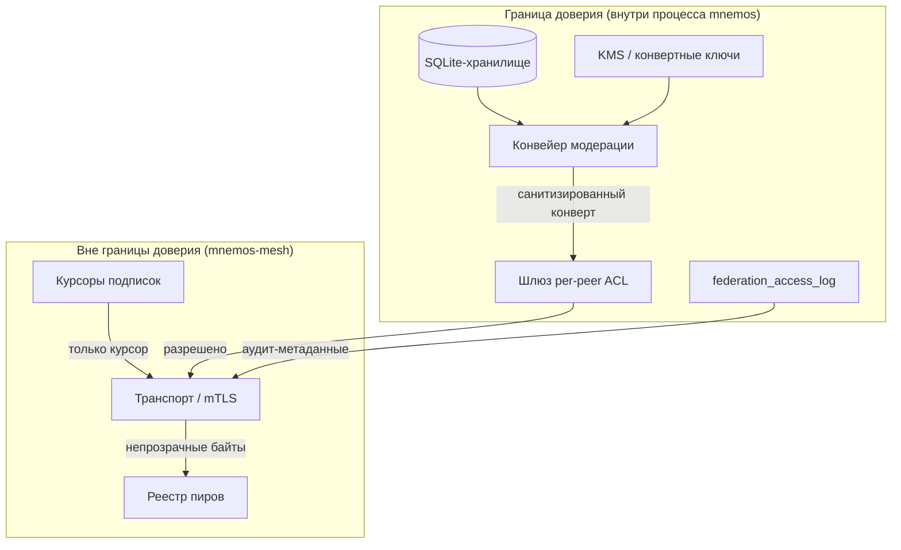
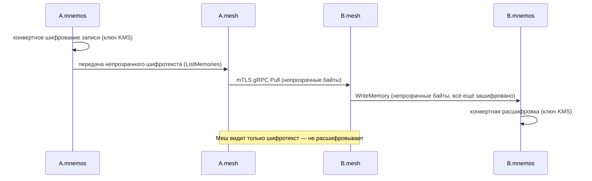

<!-- GENERATED by sync_docs (curated translation of mnemos-mesh@331ef3a785c1) from viewer/src/features/docs/curated/mnemos-mesh/ru/admin/security.md — правки в curated-файле, не здесь -->


# Модель безопасности mnemos-mesh для оператора

mnemos-mesh — **«глупый транспорт»**. Он стоит за пределами границы
доверия mnemos: ничего не расшифровывает, ничего не модерирует, ничего
не хранит. Этот гайд описывает границу доверия, настройку mTLS,
per-peer ACL и работу с ключами, которые оператор обязан понимать,
чтобы поднять меш безопасно.

> **Аудитория:** операторы, разворачивающие пир федерации. Полная
> модель угроз — ADR-0016 в репозитории mnemos
> (`mnemos/docs/project/adr/0016-federation-threat-model.md`).
> Об архитектуре —
> [../architecture.md](https://github.com/Korrnals/mnemos-mesh/blob/331ef3a785c1a74fb9f8972ff93cd6db5a8fc174/docs/architecture.md).

---

## 1. Граница доверия

Меш живёт **за пределами** границы доверия (критерий 10). Всё, что
умеет расшифровывать, принимать решения или хранить контент, остаётся
внутри mnemos.



### Внутри границы доверия (владелец — mnemos)

| Компонент | Полномочия | Критерий |
|---|---|---|
| SQLite-хранилище | Читает и пишет его только mnemos | 6, 11 |
| KMS / конвертные ключи шифрования | Никогда не покидают mnemos; у меша нет ключевого материала | 1, 4 |
| Конвейер модерации (детектор секретов, скраббер PII, подстановка нейтральных значений) | Работает в Python на экспорте и на pull; меш его не запускает | 2 |
| Шлюз per-peer ACL (проекты/типы/теги) | Проверяет mnemos по `peer_id` + `project_scope`; меш лишь переносит поля | 5 |
| `federation_access_log` (аудит стороны B) | Пишет mnemos; меш пересылает только указатель (`access_log_entry_id`) | контракт §10 |

### Вне границы доверия (владелец — меш)

| Компонент | Что хранит | Чего НЕ хранит |
|---|---|---|
| Реестр пиров | id пиров, адреса, зафиксированные отпечатки | Ни контента, ни ключей |
| Транспорт (mTLS) | Сертификаты на проводе, состояние соединений | Не расшифровывает полезную нагрузку |
| Курсоры подписок | Непрозрачные токены возобновления (выпущенные стороной B) | Ни тел записей |

**Сценарий компрометации.** Если процесс меша скомпрометирован,
атакующий получает только транспортные метаданные и непрозрачный
шифротекст — но никогда ни открытый текст памяти, ни ключи. У меша
нет SQLite-хендла, он не вызывает Python-код модерации, не держит
ключей расшифровки.

---

## 2. Настройка mTLS

mTLS (критерий 3) даёт федерации взаимную аутентификацию пир-с-пиром
на **приватном CA** и **зафиксированных отпечатках** — эшелонированная
защита от компрометации CA.

### Свойства

| Свойство | Политика | Критерий |
|---|---|---|
| CA | Приватный CA, управляемый вне канала; **никогда** публичный CA | 3 |
| Сертификат пира | Один сертификат на узел, CN = `node_id` | 3 |
| Взаимная аутентификация | Обе стороны предъявляют и проверяют сертификаты (mTLS) | 3 |
| Пиннинг | Отпечатки пиров зафиксированы в `mtls.peer_fingerprints` | 3 |
| Ротация | `mtls.rotation_days` (дефолт 90); меш перезагружает материал по SIGHUP, не роняя живые потоки (M5) | 3 |
| Привязка личности | `node_id` из CN сертификата связывается с `peer_id` в ACL и `federation_access_log` | 3, 5, §10 |
| Минимальная версия TLS | TLS 1.3 (`tls.VersionTLS13`) | жёсткое правило |

### Сгенерировать CA и сертификаты узлов

Готовые команды `openssl` — в
[первом запуске, §2](mnemos-mesh/user/getting-started#2--generate-mtls-material).
Ключевые пункты:

- Один CA на федерацию, хранится офлайн.
- Один сертификат узла на пир, CN **обязан** совпадать с `node_id`.
- Отпечаток каждого пира зафиксирован в `mtls.peer_fingerprints`.

### Пиннинг — защита от компрометации CA

При подключении пира меш проверяет **две** вещи:

1. Сертификат пира цепляется к настроенному приватному CA
   (`ClientAuth = RequireAndVerifyClientCert`).
2. SHA-256-отпечаток сертификата пира совпадает с зафиксированной
   записью в `mtls.peer_fingerprints`, ключом которой служит id пира
   (CN сертификата).

Проверка пиннинга выполняется в `VerifyPeerCertificate` **после**
стандартной проверки цепочки. Пир, чей CA прошёл проверку, но чей
отпечаток не зафиксирован, отклоняется с `ErrUnknownPeer`. Это ловит
скомпрометированный CA, выпустивший сертификат атакующему: его
сертификат пройдёт цепочку, но провалит пин.

### Связка личности пира ↔ TLS-сертификата

Меш извлекает `peer_id` из CN проверенного клиентского сертификата и
использует его для (a) per-peer проверки ACL и (b) поля `peer_id` в
каждом RPC-запросе. Пир **не может** выдать себя за другой узел:
проверка сертификата проваливается до любого RPC.

---

## 3. Per-peer ACL

Per-peer ACL (критерий 5) — это **ШЛЮЗ**, который проверяет mnemos, а
**не** меш. Меш переносит относящиеся к ACL поля (`peer_id`,
`project_scope`, фильтры запроса) в RPC; mnemos сверяет их со своим
per-peer конфигом, прежде чем вернуть хоть какую-то запись.

### Где enforced

| Слой | Что делает | Кто |
|---|---|---|
| mTLS (меш) | Проверяет личность пира; отклоняет неизвестных | меш |
| Шлюз ACL (mnemos) | Фильтрует проекты/типы/теги по per-peer списку разрешённого | mnemos |
| Модерация (mnemos) | Секреты + PII + нейтральные значения, на текущей версии | mnemos |

Единственная роль меша в ACL — **проверка личности** (mTLS).
Контентный ACL (какие проекты/типы/теги пир может получить) —
полномочие mnemos: меш не расшифровывает и потому не может
инспектировать контент ради контентного ACL.

### Форма конфигурации

```yaml
peers:
  - id: mnemos-B
    address: b.example.invalid:8443
    fingerprint: sha256:abcdef0123456789...
    projects: ["project-mnemos"]   # меш переносит, mnemos проверяет
```

Полная схема `peers[]` — в
[справочнике конфигурации](mnemos-mesh/user/configuration#peers).

> **Жёсткое правило.** Не реализуйте проверку ACL в меше. Любой Go-код,
> инспектирующий контент ради проектов/типов/тегов, отвергается на
> ревью — жёсткое правило 4 в
> [CONTRIBUTING.md](https://github.com/Korrnals/mnemos-mesh/blob/331ef3a785c1a74fb9f8972ff93cd6db5a8fc174/CONTRIBUTING.md).

---

## 4. Работа с ключами

**Где живут ключи:** конвертные ключи шифрования принадлежат mnemos
(или его интеграции с KMS), **никогда** — мешь. У меша только его
собственный приватный mTLS-ключ для аутентификации пиров — и тот
защищает целостность транспорта, а не конфиденциальность нагрузки.

### Поток конвертного шифрования (критерии 1, 4)



**Свойства:**

- mnemos шифрует нагрузку **до** передачи мешь; меш переносит
  непрозрачные байты.
- mnemos на принимающей стороне расшифровывает **после** получения от
  локального меша; ключ на базе KMS есть только у mnemos.
- mTLS защищает транспорт (целостность + конфиденциальность на
  проводе); конвертное шифрование защищает «в покое и в пути» (защита
  на случай компрометации узла меша или его диска).
- Меш **не держит** ключей расшифровки. Украденный бинарник меша не
  прочитает ни одну нагрузку, которую он когда-либо переносил.

> **НЕ** кладите ключи расшифровки в меш. Любой дизайн, требующий от
> меша расшифровки, вне скоупа и должен быть отвергнут (критерий 1,
> жёсткое правило).

---

## 5. Сводка модели угроз федерации

Полная модель угроз — в ADR-0016 репозитория mnemos
(`mnemos/docs/project/adr/0016-federation-threat-model.md`). Сводка
остаточных рисков, принятых дизайном федерации:

| Риск | Митигация | Обоснование принятия |
|---|---|---|
| Скомпрометированный процесс меша | У меша нет ключей, открытого текста и хранилища | Атакующий получает только транспортные метаданные и шифротекст |
| Скомпрометированный приватный CA | Зафиксированные отпечатки ловят враждебный сертификат | Пиннинг — вторая проверка поверх валидации CA |
| Дамп памяти процесса меша | В меше нет ключевого материала | Только приватный mTLS-ключ — защищает транспорт, не нагрузки |
| Повтор перехваченных конвертов | Конвертное шифрование + воспроизведение курсора при переподключении | Расшифровывает mnemos на конце; курсоры непрозрачны и выпущены стороной B |
| Устаревшее состояние между синками | gRPC-стриминг + `Subscribe` с курсорами (критерий 9) | Живые обновления вместо лага батч-синка фазы 0 |

Полный перечень угроз, остаточных рисков и обоснований их принятия — в
ADR-0016.

---

## См. также

- [ADR-0016 — модель угроз федерации](https://github.com/vesmaro/vesmaro/blob/23f0fce42ea87c329d4049397292b3dca948773c/docs/project/adr/0016-federation-threat-model.md) (репозиторий mnemos)
- [Архитектура](https://github.com/Korrnals/mnemos-mesh/blob/331ef3a785c1a74fb9f8972ff93cd6db5a8fc174/docs/architecture.md) — границы доверия, ключи, потоки данных
- [Справочник конфигурации](mnemos-mesh/user/configuration) — поля `mesh.yaml`
- [Первый запуск](mnemos-mesh/user/getting-started) — генерация материала mTLS
- [CONTRIBUTING.md](https://github.com/Korrnals/mnemos-mesh/blob/331ef3a785c1a74fb9f8972ff93cd6db5a8fc174/CONTRIBUTING.md) — жёсткие правила контрибуций
